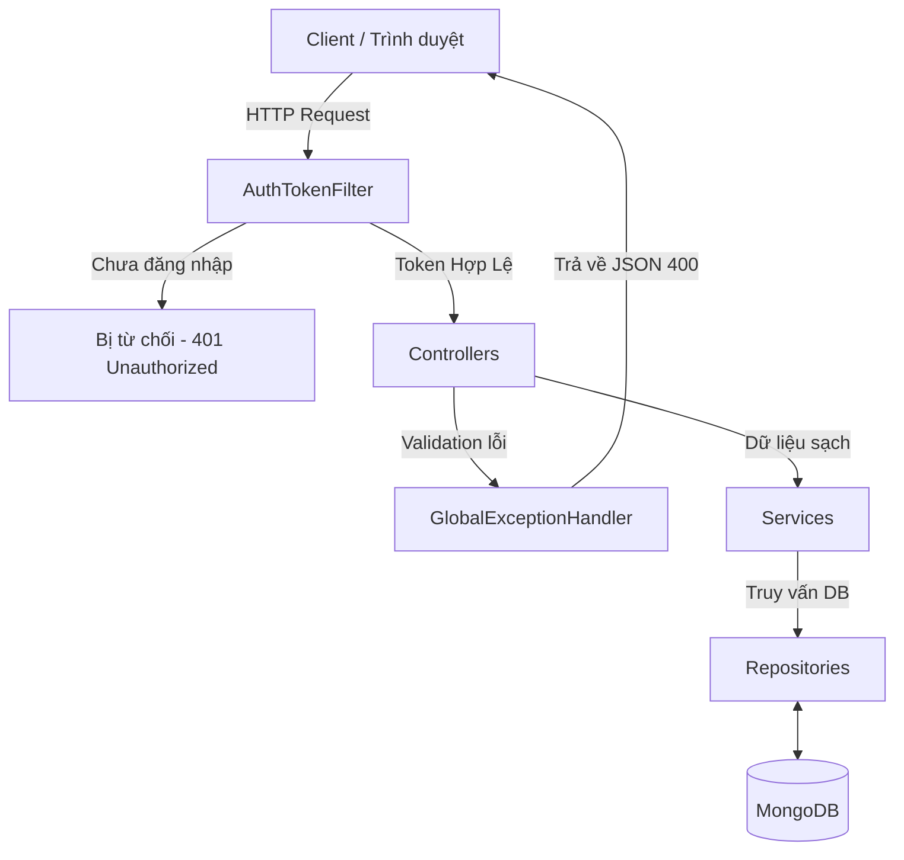

# 🛡️ Enterprise Spring Boot Security & Authentication API

Một hệ thống nền tảng Backend vững chắc (Boilerplate) được xây dựng trên **Spring Boot** và **MongoDB**, cung cấp các tính năng xác thực người dùng bằng JWT (JSON Web Token), Quản lý quyền hạn (RBAC), Xử lý lỗi toàn cục và Tự động Auditing.

Dự án này là minh chứng cho kiến trúc phân tầng chuẩn, sẵn sàng để có thể "clone" về và mở rộng nghiên cứu thành các dự án thực tế.

---

## ✨ Tính Năng Nổi Bật (Features)

- 🔒 **Bảo mật tuyệt đối**: Xác thực Stateless (không trạng thái) sử dụng JWT. Mật khẩu được băm an toàn bằng BCrypt.
- 👨‍💻 **Phân quyền (RBAC)**: Hỗ trợ linh hoạt các vai trò như `USER` và `ADMIN`. Bảo vệ chặt chẽ các API tương ứng.
- 🛡️ **Kiểm duyệt Dữ liệu (Validation)**: Tự động đánh chặn các dữ liệu rác, email sai định dạng, mật khẩu yếu ngay từ "cửa ngõ" Controller.
- ⚡ **Xử lý Ngoại lệ Toàn cục**: Bắt mọi lỗi xảy ra trong hệ thống và trả về chuỗi JSON thân thiện, đồng nhất (`GlobalExceptionHandler`).
- 🕒 **Tự động Auditing**: Tự động lưu vết thời gian `createdAt` và `updatedAt` mỗi khi Dữ liệu (User) có sự thay đổi.
- 🏗️ **Kiến trúc Clean Architecture**: Tách biệt rõ ràng ranh giới giữa Controller, Service, DTO và Repository.

---

## 🏗️ Kiến Trúc Hệ Thống (Architecture)

Mô hình hoạt động của luồng xác thực và xử lý dữ liệu trong hệ thống:



---

## 🛠️ Yêu Cầu Môi Trường (Prerequisites)

Để chạy được dự án này, máy tính cần được cài đặt sẵn:
1. **Java Development Kit (JDK 8)** (hoặc cao hơn).
2. **MongoDB** (Đang chạy ở cổng mặc định `localhost:27017`).
3. **Trình duyệt / Postman** (để test API).
*(Lưu ý: Dự án sử dụng Gradle wrapper nên bạn không cần cài Gradle thủ công trên máy).*

---

## 🚀 Hướng Dẫn Cài Đặt & Chạy Dự Án (Getting Started)

### Bước 1: Tải mã nguồn về máy
```bash
git clone https://github.com/KietVo12/BMMMT.git
cd BMMMT
# Chuyển sang nhánh kiến trúc nâng cao
git checkout feature/enterprise-architecture 
```

### Bước 2: Cấu hình Cơ sở dữ liệu
Đảm bảo bạn đã bật ứng dụng MongoDB (hoặc MongoDB Compass). Dự án sẽ tự động kết nối và tạo cơ sở dữ liệu có tên `secureapi` ở cổng `27017`.
Nếu MongoDB của bạn có dùng mật khẩu, hãy sửa cấu hình tại file `src/main/resources/application.properties`:
```properties
spring.data.mongodb.host=localhost
spring.data.mongodb.port=27017
spring.data.mongodb.database=secureapi
# Bỏ comment nếu MongoDB có pass:
# spring.data.mongodb.username=root
# spring.data.mongodb.password=password123
```

### Bước 3: Chạy ứng dụng (Build & Run)
Mở Terminal / Command Prompt tại thư mục gốc của dự án và gõ lệnh:

- **Dành cho Windows:**
  ```cmd
  .\gradlew.bat bootRun
  ```
- **Dành cho macOS / Linux:**
  ```bash
  ./gradlew bootRun
  ```

Hệ thống sẽ tải toàn bộ thư viện và chạy máy chủ ở cổng `8080`. Khi thấy dòng chữ `Started SecureApiApplication`, chúc mừng bạn đã cài đặt thành công! 🎉

---

## 📂 Kiến Trúc Thư Mục (Project Structure)

```text
src/main/java/com/example/
├── config/             # Cấu hình dự án (MongoDB Auditing, Security Beans)
├── controller/         # Chứa API Endpoint và các định tuyến Web (View)
├── dto/                # Data Transfer Objects (Hứng/Trả dữ liệu chuẩn xác)
├── exception/          # Global Exception Handler (Xử lý bắt lỗi trả về JSON)
├── model/              # Entity ánh xạ trực tiếp vào Database MongoDB
├── repository/         # Chịu trách nhiệm query/ghi dữ liệu vào DB
├── security/           # Lõi bảo mật (JWT Utils, Token Filter)
└── service/            # Tầng Logic nghiệp vụ phức tạp (AuthService)
```

---

## 🌐 Các API Chức Năng Chính (Endpoints)

Bạn có thể sử dụng Postman hoặc giao diện Web tích hợp sẵn để thử nghiệm các API này:

**1. Xác thực & Đăng nhập (Authentication)**
- `POST /api/auth/signup`: Đăng ký tài khoản mới (Yêu cầu đầy đủ username, email, firstName, lastName, password).
- `POST /api/auth/login`: Đăng nhập lấy Token JWT.
- `GET /api/auth/user`: Xem thông tin tài khoản hiện tại (Yêu cầu gửi kèm Token trên Header).

**2. Test Quyền Hạn (Authorization)**
- `GET /api/test/all`: Mở công khai, ai cũng xem được.
- `GET /api/test/user`: Yêu cầu phải có Token hợp lệ.
- `GET /api/test/admin`: Yêu cầu Token hợp lệ và phải có quyền `ROLE_ADMIN`.

**3. Giao Diện (Thymeleaf UI)**
Dự án được tích hợp sẵn Frontend đơn giản tại `http://localhost:8080/`. Các trang khả dụng:
- `/login`, `/register`: Các biểu mẫu xác thực.
- `/dashboard`: Trang dành cho thành viên thông thường.
- `/admin`: Trang quản trị nội bộ.

---

## 🐛 Khắc phục lỗi thường gặp (Troubleshooting)

1. **Lỗi `Connection refused: no further information`**:
   - *Nguyên nhân*: Thường là chưa bật MongoDB hoặc cổng `27017` bị khóa.
   - *Cách giải quyết*: Hãy cài đặt/bật MongoDB Service lên.

2. **Lỗi `Dữ liệu đầu vào không hợp lệ (Status 400)`**:
   - *Nguyên nhân*: Lúc test `/api/auth/signup`, bạn gửi thiếu trường hoặc email sai định dạng.
   - *Cách giải quyết*: Xem lại format body JSON, dự án này đã bật `Validation` rất khắt khe để bảo vệ Database!

---
